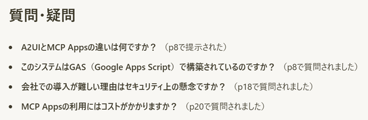

[Agentic Tokyo #1](https://aibuilders.connpass.com/event/394175/)というイベントで、「[MCP Appsを作ってみよう](https://speakerdeck.com/iwamot/hello-mcp-apps)」という発表をしました。

<!--more-->

MCP Appsは、MCPサーバーからUIを返せる、MCPの拡張機能です。

いろんなことができて楽しいので、ぜひ広めたいと思っていたところに、登壇のお誘いをいただいたのでした。

## 弾幕プレゼン、カオスだった

発表にあたって、ぼく自身、MCP Appを新たに作りました。

- https://github.com/iwamot/danmaku-slides

PDFスライドを映しつつ、参加者のコメントを弾幕で流せるプレゼンツールです。

実際に使ってみると、なかなかカオスな感じでした。当日の様子は、[ツイートまとめ](https://posfie.com/@minorun365/p/i89odIp)でご確認いただけます。

盛り上げていただいた参加者のみなさま、本当にありがとうございました。

## いただいた質問への回答

弾幕コメントのなかには、質問もありました。

当日お答えする余裕がなかったので、ここで回答させてください。

- **A2UIとMCP Appsの違いは何ですか？**
  - 最大の違いは「誰がどうUIを組み立てるか」です。A2UIの場合は、LLMがUIの設計図にあたるデータを返し、受け取ったホストが自分の部品でUIを組み立てて表示します。MCP Appsの場合は、完成済みのUIをMCPサーバーが返します。

- **このシステムはGAS (Google Apps Script) で構築されているのですか？**
  - コメントを集める部分はGASです。プレゼンツール自体は、ローカルで動かしていました。詳しくはリポジトリをご参照ください。

- **会社での導入が難しい理由はセキュリティ上の懸念ですか？**
  - 文脈が分からなくなってしまったのですが、「このプレゼンツールを会社で使うのは難しいかもしれない」というようなことをぼくが言ったのかもしれません。だとしたら、「業務で使うにはカオスすぎるから」が回答となります（笑）。

- **MCP Appsの利用にはコストがかかりますか？**
  - MCP Appsそのものの利用にはかかりません。LLMや運用環境のコストはかかります。

## 発表きっかけのMCP Apps

ぼくの発表をご覧になり、実際に手を動かした方がいらっしゃいました。

- [Claude Code のスキルに「いい感じの MCP App 作って」と丸投げしたら、いい感じの触れるダッシュボードができた](https://qiita.com/leomarokun/items/668a9a3f4374bd14d2d1)
- https://github.com/tajas20006/neko-mcp-app

発表した甲斐がありました。ありがとうございます！！
